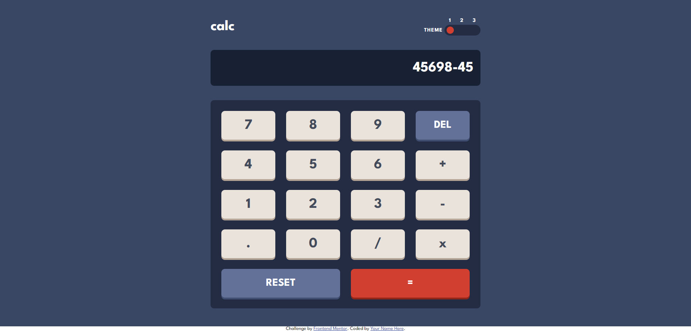
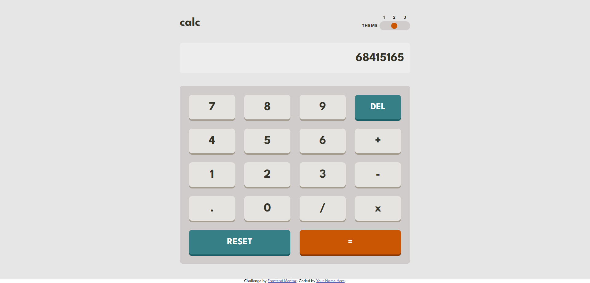
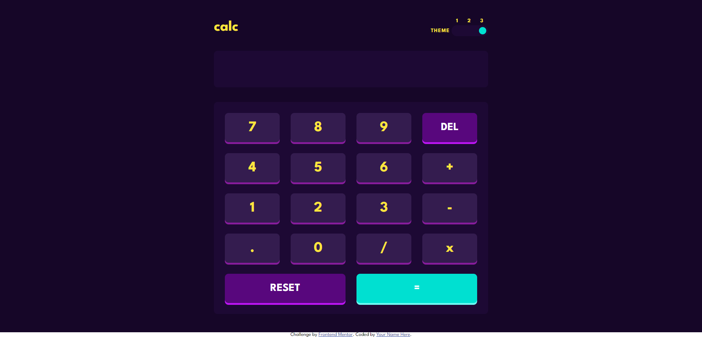
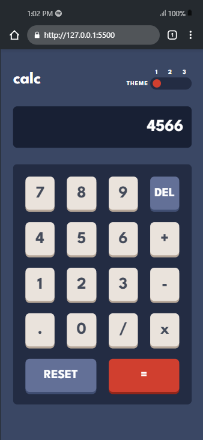
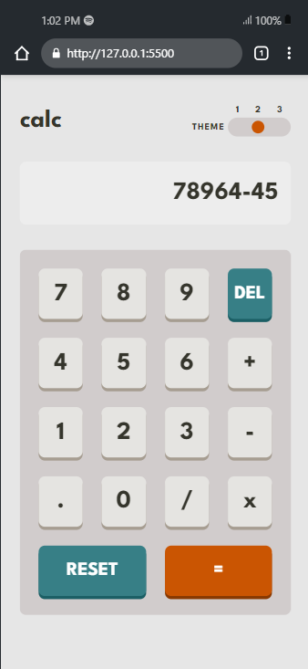
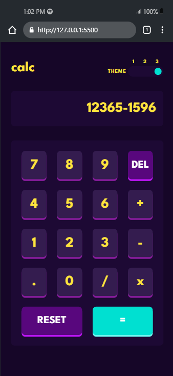
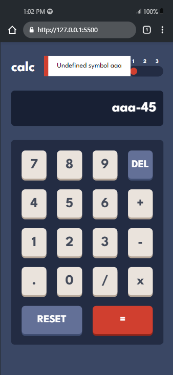

# Frontend Mentor - Calculator app solution

This is a solution to the [Calculator app challenge on Frontend Mentor](https://www.frontendmentor.io/challenges/calculator-app-9lteq5N29). Frontend Mentor challenges help you improve your coding skills by building realistic projects.

## Table of contents

- [Overview](#overview)
  - [The challenge](#the-challenge)
  - [Screenshot](#screenshot)
  - [Links](#links)
- [My process](#my-process)
  - [Built with](#built-with)
  - [What I learned](#what-i-learned)
  - [Continued development](#continued-development)
  - [Useful resources](#useful-resources)
- [Author](#author)
- [Acknowledgments](#acknowledgments)

## Overview

### The challenge

Users should be able to:

- See the size of the elements adjust based on their device's screen size
- Perform mathmatical operations like addition, subtraction, multiplication, and division
- Adjust the color theme based on their preference
- **Bonus**: Have their initial theme preference checked using `prefers-color-scheme` and have any additional changes saved in the browser

### Screenshot

- Desktop Design Theme -1



- Desktop Design Theme -2



- Desktop Design Theme -3



- Mobile Design Theme -1



- Mobile Design Theme -2



- Mobile Design Theme -3



- Error Message



### Links

- Live Site URL: [Live Site](https://calculator-app-abinandan.netlify.app/)

## My process

### Built with

- Custom CSS
- Flexbox
- CSS Grid
- Mobile-first workflow (Media Queries)
- Vanilla JavaScript
- **<u>Mathjs</u>**

### What I learned

- I created a notification tab (like the react toastify) which pops up when incorrect values are entered.

```html
<aside>
  <div class="message">
    <p></p>
  </div>
</aside>
```

- I styled that notification tab :

```css
aside {
  position: fixed;
  display: grid;
  top: -5rem;
  left: 50%;
  transform: translateX(-50%);
  background: var(--white);
  min-height: 2rem;
  width: 50%;
  border-left: 10px solid var(--red-1);
  transition: top 0.3s ease-in;
  max-width: 400px;
}
.notify {
  top: 2rem;
}
.message {
  display: grid;
  place-items: center;
  padding: 1rem;
}
```

- Using JS, I made the notification to appear for 3s and then it vanishes.

```js
if (value === "=") {
  try {
    output.value = math.evaluate(output.value) ?? output.value;
  } catch (error) {
    // NOTIFY THE ERROR LIKE REACT TOASTIFY
    aside.classList.add("notify");
    setTimeout(() => {
      aside.classList.remove("notify");
    }, 3000);
    const message = aside.querySelector(".message p");
    message.textContent = error.message;
  }
}
```

If you want more help with writing markdown, we'd recommend checking out [The Markdown Guide](https://www.markdownguide.org/) to learn more.

## Author

- Website - [Abinandan A T](https://my-portfolio-1z8s.onrender.com/)
- Frontend Mentor - [@Abinandan1](https://www.frontendmentor.io/profile/Abinandan1)
